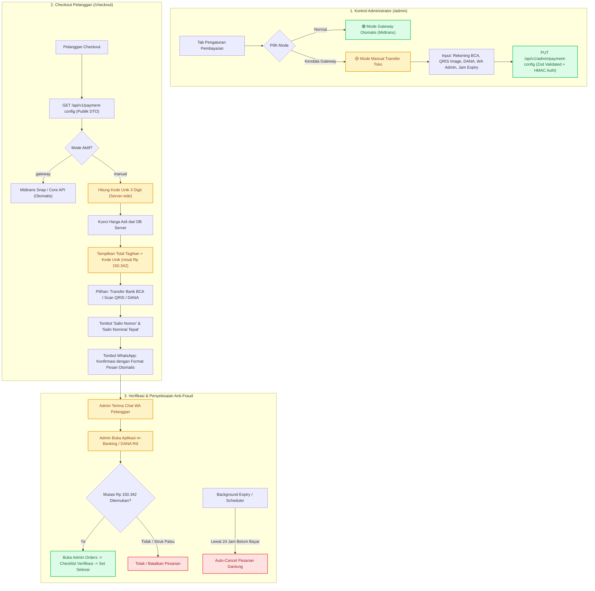

# 🛡️ Hardened Implementation Plan: Payment Mode Switcher & Zero-Trust Failover System (Gateway vs Manual)

Sistem peralihan mode pembayaran (*Payment Mode Switcher*) Asterra Store dirancang dengan prinsip **Zero-Trust Security & Anti-Fraud Architecture**. Sistem ini memungkinkan administrator untuk beralih secara instan antara **Payment Gateway Otomatis (Midtrans)** dan **Transfer Manual Toko (Bank BCA, QRIS Toko, No DANA)** tanpa celah manipulasi harga (*price tampering*), penipuan bukti transfer palsu (*fake slip fraud*), maupun penumpukan pesanan gantung (*abandoned order spam*).

---

## 🔒 1. Matriks Mitigasi Keamanan (Security Hardening Matrix)

| Vektor Ancaman (Threat Vector) | Risiko & Dampak | Kontrol Keamanan (Mitigasi Wajib) |
|---|---|---|
| **1. Manipulasi Harga (*Price Tampering*)** | Attacker mengirim payload `unit_price: 500` saat checkout. | **Strict Server-Side Price Locking**: Backend `POST /api/v1/orders` 100% menghitung ulang harga dari database katalog server (`product.price`). Payload harga dari client diabaikan sepenuhnya. |
| **2. Bukti Transfer Palsu (*Fake Slip / Photoshop*)** | Pelanggan mengirim screenshot m-Banking / QRIS palsu via WA admin. | **Kode Unik Acak 3 Digit (*Unique Payment Code*)**: Misal Rp 150.000 menjadi Rp 150.382. Admin cukup mencocokkan nominal 3 digit di mutasi rekening m-banking tanpa tertipu visual struk. |
| **3. Pesanan Gantung (*Abandoned Orders*)** | Bot/spammer membuat ribuan pesanan manual tanpa bayar. | **Order Expiry Window**: Pesanan manual memiliki batas waktu kedaluwarsa (misal 12/24 jam). Jika lewat batas, pesanan otomatis berstatus `cancelled`. |
| **4. Human Error Admin (Kecolongan Klik Selesai)** | Admin terburu-buru menandai pesanan selesai sebelum cek rekening. | **Dual-Step Verification Modal**: Modal konfirmasi status di panel admin mewajibkan checklist: *"Saya sudah memverifikasi mutasi rekening riil m-Banking/DANA, bukan hanya screenshot."* |
| **5. Injeksi Data Rekening (*Stored XSS / Malicious URL*)** | Pengaturan rekening admin disusupi script berbahaya. | **Zod Schema Validation & Sanitization**: Validasi ketat nomor rekening (numerik), URL QRIS (URL valid), nomor HP (format internasional/lokal). |
| **6. Kebocoran Kunci Rahasia (*Secret Key Leakage*)** | Endpoint publik mengekspos konfigurasi private. | **DTO Projection**: Endpoint publik `/api/v1/payment-config` hanya mengekspos informasi publik untuk transfer, tanpa pernah membocorkan `MIDTRANS_SERVER_KEY` atau session secret. |
| **7. Replay Attack & Duplicate Fulfillment Webhook** | Webhook dipanggil berulang kali saat order sudah berstatus selesai. | **Idempotent Webhook Consumer**: Cek status transaksi terlebih dahulu; jika sudah `completed` atau `cancelled`, abaikan tanpa memicu ulang pemrosesan. |

---

## 🏛️ 2. Diagram Alur Sistem & Batasan Kepercayaan (Trust Boundaries)



---

## 🗄️ 3. Skema Data & Model Prisma

### A. Model `PaymentSetting` di `prisma/schema.prisma`
```prisma
model PaymentSetting {
  id                    String   @id @default("default_setting")
  mode                  String   @default("gateway") // "gateway" | "manual"
  
  // Rekening Bank Manual Toko
  bankName              String?  @default("Bank Central Asia (BCA)") @map("bank_name")
  bankAccountNumber     String?  @default("8965123456") @map("bank_account_number")
  bankAccountName       String?  @default("Asterra Store Official") @map("bank_account_name")

  // QRIS Manual Toko
  qrisImageUrl          String?  @map("qris_image_url") @db.Text
  qrisMerchantName      String?  @default("ASTERRA STORE QRIS") @map("qris_merchant_name")

  // E-Wallet DANA Manual
  danaNumber            String?  @default("081234567890") @map("dana_number")
  danaAccountName       String?  @default("Asterra Store") @map("dana_account_name")

  // WhatsApp Admin untuk Konfirmasi
  confirmationWhatsapp  String?  @default("081234567890") @map("confirmation_whatsapp")
  instructions          String?  @db.Text

  // Fitur Keamanan Anti-Fraud
  enableUniqueCode      Boolean  @default(true) @map("enable_unique_code") // Tambah kode unik 3 digit
  orderExpiryHours      Int      @default(24) @map("order_expiry_hours")   // Jam batas bayar sebelum auto-cancel

  updatedAt             DateTime @updatedAt @map("updated_at")

  @@map("payment_settings")
}
```

### B. Pembaruan Model `Order` di `prisma/schema.prisma`
```prisma
model Order {
  id                String      @id
  userId            String?     @map("user_id")
  customerName      String?     @map("customer_name")
  customerEmail     String?     @map("customer_email")
  customerWhatsapp  String?     @map("customer_whatsapp")
  customerNotes     String?     @map("customer_notes") @db.Text
  
  totalAmount       Int         @map("total_amount")      // Total akhir (termasuk kode unik jika manual)
  rawAmount         Int?        @map("raw_amount")        // Total harga asli sebelum kode unik
  uniqueCode        Int?        @map("unique_code")       // Kode unik 3 digit (misal: 284)
  
  paymentMode       String      @default("gateway") @map("payment_mode") // "gateway" | "manual"
  paymentMethod     String?     @map("payment_method")    // "qris" | "bca" | "dana" | "midtrans_snap"
  
  status            String      @default("pending")       // "pending" | "processing" | "completed" | "cancelled"
  expiresAt         DateTime?   @map("expires_at")        // Waktu kedaluwarsa pesanan
  
  createdAt         DateTime    @default(now()) @map("created_at")
  updatedAt         DateTime    @updatedAt @map("updated_at")

  @@index([status])
  @@index([paymentMode])
  @@index([expiresAt])
  @@map("orders")
}
```

---

## 🔌 4. Spesifikasi API Endpoint & Keamanan

### 1. `GET /api/v1/payment-config` (Akses: Publik)
* **Tujuan**: Diambil oleh halaman `/checkout` saat dimuat.
* **Payload Response (DTO Aman)**:
  ```json
  {
    "success": true,
    "data": {
      "mode": "manual",
      "bank": {
        "name": "Bank Central Asia (BCA)",
        "account_number": "8965123456",
        "account_name": "Asterra Store Official"
      },
      "qris": {
        "image_url": "/images/qris-toko.png",
        "merchant_name": "ASTERRA STORE QRIS"
      },
      "dana": {
        "number": "081234567890",
        "account_name": "Asterra Store"
      },
      "confirmation_whatsapp": "6281234567890",
      "enable_unique_code": true,
      "order_expiry_hours": 24
    }
  }
  ```

### 2. `GET /api/v1/admin/payment-config` (Akses: Admin)
* **Tujuan**: Memuat konfigurasi lengkap pembayaran untuk panel admin.
* **Proteksi**: Diperiksa oleh `src/proxy.ts` (HMAC-SHA256 session token).

### 3. `PUT /api/v1/admin/payment-config` (Akses: Admin)
* **Tujuan**: Admin melakukan toggle switch mode dan update rekening.
* **Validasi Skema Zod (Strict Validation)**:
  ```typescript
  import { z } from 'zod';

  export const paymentConfigSchema = z.object({
    mode: z.enum(['gateway', 'manual']),
    bankName: z.string().min(2).max(100),
    bankAccountNumber: z.string().regex(/^[0-9A-Za-z\- ]{5,30}$/, 'Nomor rekening tidak valid'),
    bankAccountName: z.string().min(2).max(100),
    qrisImageUrl: z.string().url().optional().or(z.literal('')),
    qrisMerchantName: z.string().min(2).max(100),
    danaNumber: z.string().regex(/^[0-9+]{8,20}$/, 'Nomor DANA tidak valid'),
    danaAccountName: z.string().min(2).max(100),
    confirmationWhatsapp: z.string().regex(/^[0-9+]{8,20}$/, 'Nomor WhatsApp tidak valid'),
    enableUniqueCode: z.boolean(),
    orderExpiryHours: z.number().int().min(1).max(168), // 1 jam s/d 7 hari
    instructions: z.string().max(2000).optional(),
  });
  ```

### 4. `POST /api/v1/orders` (Perbaikan Celah Manipulasi Harga & Kode Unik)
* **Security Fix**:
  ```typescript
  // 1. Kunci harga server-side dari database catalog (Abaikan item.unit_price dari client!)
  const product = await AdminCatalogStore.getProductById(baseProductId);
  const strictUnitPrice = product?.price || fallbackPrice;
  
  // 2. Jika mode pembayaran aktif adalah "manual" dan enableUniqueCode aktif:
  const uniqueCode = isManualMode ? Math.floor(100 + Math.random() * 900) : 0;
  const totalAmount = rawItemTotal + uniqueCode;
  const expiresAt = new Date(Date.now() + expiryHours * 60 * 60 * 1000);
  ```

### 5. `PATCH /api/v1/admin/orders/[id]/status`
* **Audit Logging**: Mencatat siapa admin yang menyetujui, metode verifikasi, dan timestamp.
* **Proteksi Replay**: Menolak perubahan jika order sudah final atau tidak valid.

---

## 💻 5. Desain UI/UX & Interaksi

### A. Panel Admin (`/admin`) — Tab "Pengaturan Pembayaran"
1. **Mode Switcher Hero Card**:
   * Banner status visual:
     * 🟢 **Mode Otomatis (Midtrans Payment Gateway)**: Pembayaran diproses otomatis oleh Midtrans webhook.
     * 🟡 **Mode Manual (Transfer Rekening & QRIS Toko)**: Pembayaran langsung ke rekening toko dengan verifikasi manual admin.
   * Tombol Toggle switch 1-klik dengan dialog konfirmasi aman.
2. **Form Pengaturan Detail Manual**:
   * Card Bank: Bank BCA (Nama, Nomor Rekening, Atas Nama, tombol Test Copy).
   * Card QRIS: Preview QRIS Toko, input URL gambar, nama merchant.
   * Card DANA: Nomor HP DANA, nama akun.
   * Card Anti-Fraud: Toggle Kode Unik 3 Digit (On/Off), Slider batas kedaluwarsa pesanan (Default: 24 Jam).
   * Card WhatsApp: Nomor WA Admin penerima konfirmasi.
3. **Live Simulator Box**:
   * Melihat langsung bagaimana tampilan checkout di sisi pelanggan saat mode ini aktif.

### B. Panel Admin — Modal Verifikasi Pesanan Manual Anti-Fraud
Saat admin memilih status **"Selesai (Completed)"** pada pesanan manual:
* Muncul modal konfirmasi verifikasi:
  * Menampilkan: **Nomor Order**, **Nama Customer**, **Nominal Tepat + Kode Unik** (misal: `Rp 150.342`).
  * Checklist verifikasi wajib:
    * `[x]` Saya telah membuka aplikasi m-Banking/DANA dan memastikan uang Rp 150.342 benar-benar masuk di mutasi riil.
  * Tombol "Konfirmasi Selesai & Kirim Produk" hanya aktif jika checklist dicentang.

### C. Halaman Checkout (`/checkout`)
1. **Jika Mode Gateway**: Tampilan standar Midtrans Snap / QRIS Realtime.
2. **Jika Mode Manual Aktif**:
   * Banner informasi ramah: *"Pembayaran Manual Toko Sedang Aktif"*.
   * Pemilihan metode transfer: **QRIS Toko**, **Transfer BCA**, atau **DANA**.
   * Menampilkan nominal transfer dengan highlight jelas:
     * Harga Pesanan: `Rp 150.000`
     * Kode Verifikasi: `+ Rp 342`
     * **Total Wajib Ditransfer: Rp 150.342** (dengan tombol salin nominal cepat).
   * Tombol Salin Nomor Rekening / DANA dengan feedback visual (*Copied!*).
   * Tombol Hijau Besar: **"Kirim Bukti Pembayaran ke WhatsApp Admin"** yang otomatis membuka chat WA dengan format pesan lengkap:
     > *"Halo Asterra Store, saya sudah melakukan transfer manual untuk pesanan #ORD-2026-XXXX sebesar Rp 150.342 ke rekening BCA. Berikut bukti transfernya:"*

---

## 🚀 6. Tahapan Eksekusi Bertahap (Phased Implementation)

1. **Fase 1: Database Model & Prisma Migration**:
   * Tambahkan model `PaymentSetting` dan perbarui model `Order` (`uniqueCode`, `rawAmount`, `paymentMode`, `expiresAt`) di `prisma/schema.prisma`.
   * Sinkronisasi Prisma schema client.

2. **Fase 2: Core Services & Price-Tampering Elimination**:
   * Buat `src/lib/services/payment-config.service.ts` dengan dukungan fallback lokal (resilience).
   * Perbaiki [src/app/api/v1/orders/route.ts](file:///c:/Iqbal/Development/Project%20Library/NextJS/Asterra%20Store/src/app/api/v1/orders/route.ts) untuk mengunci harga 100% dari catalog database dan menerapkan kode unik acak 3 digit pada mode manual.

3. **Fase 3: Backend API Endpoints & Zod Validation**:
   * Buat `src/app/api/v1/payment-config/route.ts` (publik DTO).
   * Buat `src/app/api/v1/admin/payment-config/route.ts` (admin CRUD dengan Zod schema).

4. **Fase 4: Panel Admin UI & Verification Modal**:
   * Buat komponen `src/components/admin/admin-payment-settings-tab.tsx`.
   * Pasang tab navigasi ke-5 di `src/app/admin/page.tsx`.
   * Tambahkan modal verifikasi anti-fraud pada `admin-orders-tab.tsx` saat menyelesaikan pesanan manual.

5. **Fase 5: Dynamic Checkout UI & WhatsApp Integration**:
   * Perbarui `src/app/checkout/page.tsx` untuk membaca mode pembayaran aktif secara dinamis.
   * Render informasi rekening, QRIS toko, kode unik, dan tombol WhatsApp instan.

6. **Fase 6: Pengujian & Validasi Kualitas**:
   * Uji coba alur switch mode di admin.
   * Uji coba validasi harga (menolak unit_price yang dimanipulasi).
   * Uji coba checkout manual dengan kode unik.
   * Validasi build `npm run build` bebas error.
