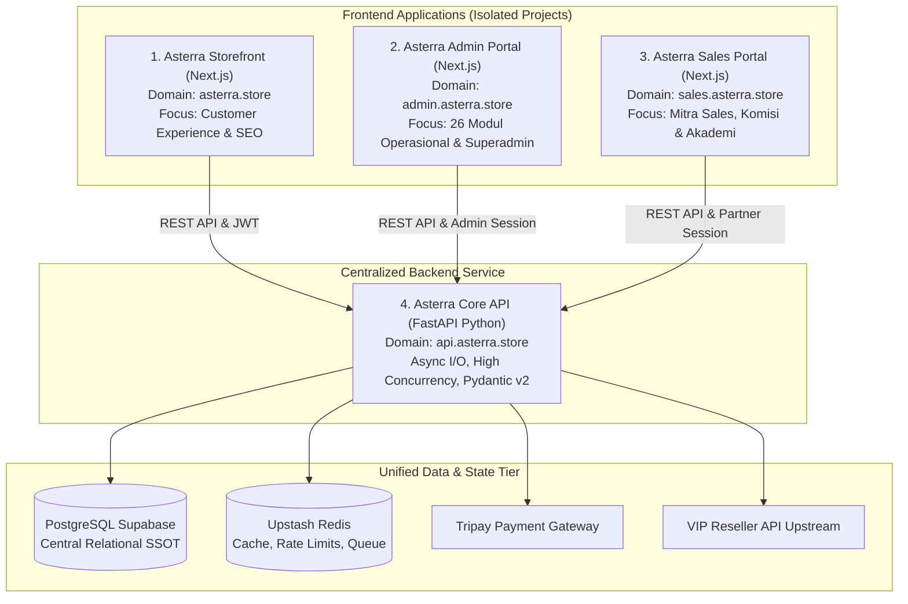
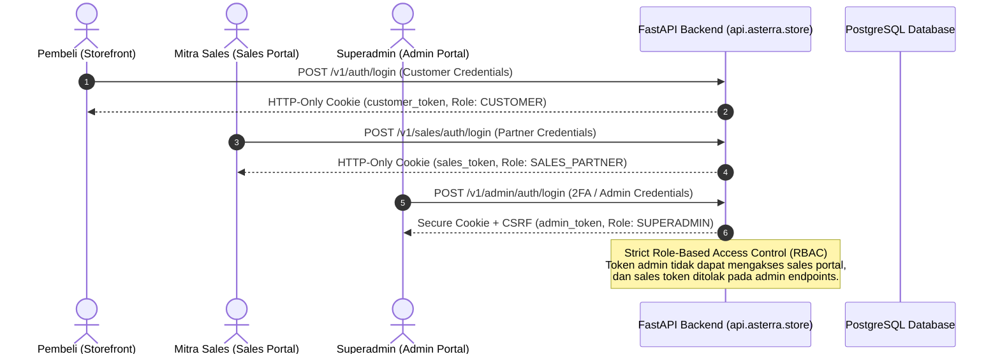

# Asterra Store — Architecture Decoupling & Multi-Project Separation Plan

> **Domain:** Distributed E-Commerce Architecture & System Decoupling  
> **Status:** Architecture Blueprint / Approved  
> **Target Stack:** FastAPI (Python), Next.js (Customer Storefront), Next.js (Admin Portal), Next.js (Sales Portal)  
> **Date:** 2026-10-07  
> **Author:** Antigravity Engineering & Knowledge OS  
> **SSOT Reference:** `C:\Iqbal\Development\Knowledge OS\07 Projects\Asterra Store\`

---

## 🏛️ 1. Executive Summary & Problem Statement

### Masalah Arsitektur Monolit Saat Ini
Asterra Store saat ini berjalan sebagai **Next.js Fullstack Monolith** di mana seluruh domain bisnis digabung dalam satu folder project:
1. **Customer Storefront** (Katalog publik, keranjang belanja, checkout, pelacakan order, profil pembeli).
2. **Admin Command Hub** (26 menu manajemen: keuangan, katalog, provider, refund, audit).
3. **Sales Affiliate Portal** (Portal kemitraan sales, pencairan komisi, tracking tim).
4. **Backend API & Background Operations** (Tripay webhook, sinkronisasi 12.500+ layanan VIP Reseller, kalkulasi waterfall profit, holding komisi).

**Dampak Negatif Monolit:**
- **Bundle Size Berat & Build Lambat:** Komponen admin (Chart, Lucide icons, data grid) dan sales suite ikut membebani proses kompilasi Next.js (`Collecting page data (54/54)`).
- **Risiko Keamanan (Attack Surface):** Logika internal admin, provider upstream, dan skrip kalkulasi berada dalam repository yang sama dengan aplikasi publik customer.
- **Keterbatasan Serverless Route Handler:** Operasi berat seperti sinkronisasi 12.500 produk VIP Reseller, webhook payment gateway berulang, dan cron evaluasi komisi rentan timeout pada limit concurrency Node.js.
- **Maintenance Kompleks:** Perubahan kecil pada fitur admin atau sales berisiko merusak alur checkout customer (dan sebaliknya).

---

## 🎯 2. Target Visi: 4 Repositori Terpisah

Pemisahan menjadi **4 Proyek Independen** dengan tanggung jawab domain tunggal (*Single Responsibility Principle*):



---

## 📁 3. Struktur Folder 4 Proyek Mandiri

Setiap aplikasi ditempatkan pada folder terpisah di `c:\Iqbal\Development\Project Library\`:

```
c:\Iqbal\Development\Project Library\
│
├── 🛒 NextJS\Asterra Store\            # PROYEK 1: CUSTOMER STOREFRONT ONLY (Repo ini)
│   ├── src\app\                        # Hanya route customer: /, /products, /checkout, /orders, /profile
│   ├── src\components\storefront\      # Hero, Catalog, Cart Drawer, Checkout Form
│   └── src\lib\api\                    # HTTP Client ringan ke api.asterra.store
│
├── ⚙️ Python\asterra-api-fastapi\       # PROYEK 2: CORE BACKEND SERVICE
│   ├── app\
│   │   ├── main.py                     # Entry point FastAPI, CORS, Exception Handlers
│   │   ├── config.py                   # Pydantic BaseSettings, Database URLs, Secrets
│   │   ├── api\v1\                     # Endpoints (/orders, /products, /promos, /affiliates, /admin, /sales)
│   │   ├── core\                       # Auth JWT, Security, Dependencies, Permissions
│   │   ├── models\                     # SQLAlchemy 2.0 / SQLModel (Order, Product, Partner, Commission)
│   │   ├── schemas\                    # Pydantic DTO Schemas (Request & Response)
│   │   ├── services\                   # Business Engines (Profit Waterfall, Tripay, VIP Reseller, Promos)
│   │   └── workers\                    # Background Tasks / Cron (APScheduler/Celery)
│   ├── alembic\                        # Database Migrations
│   └── requirements.txt
│
├── 💼 NextJS\asterra-admin-portal\     # PROYEK 3: ADMIN COMMAND CONSOLE
│   ├── src\app\                        # /dashboard, /orders, /catalog, /finance, /logs, /settings
│   ├── src\components\admin\           # 26 Modular Suite Tab Components
│   └── src\lib\api\                    # Admin API Client dengan Bearer Token
│
└── 🤝 NextJS\asterra-sales-portal\     # PROYEK 4: MITRA SALES & AFFILIATE HUB
    ├── src\app\                        # /portal, /network, /payout, /academy, /daftar
    ├── src\components\sales\           # Sales Console Suite, Referral Link Generator, Network Tree
    └── src\lib\api\                    # Sales Partner API Client
```

---

## 🐍 4. Spesifikasi Teknis: FastAPI Core Backend

### Mengapa FastAPI (Python)?
1. **Asynchronous & Concurrency:** Menangani ribuan request pembayaran, webhook Tripay, dan polling status tanpa blocking event loop Node.js.
2. **Pydantic v2 Type Safety:** Validasi schema payload, request, dan response super cepat dengan runtime enforcement berbasis Rust.
3. **Worker & Background Tasks Terintegrasi:** Sinkronisasi berkala 12.500+ layanan VIP Reseller dapat dijalankan di background thread tanpa membebani respon user.
4. **Dokumentasi Otomatis:** Menghasilkan Swagger UI (`/docs`) dan ReDoc (`/redoc`) interaktif otomatis untuk seluruh tim frontend.

### Pemetaan Endpoint Next.js ➔ FastAPI

| Domain | Route Handler Lama (Next.js) | Endpoint Baru (FastAPI) | Deskripsi |
|---|---|---|---|
| **Katalog** | `GET /api/v1/products` | `GET /v1/products` | Katalog publik dengan Redis cache |
| **Pesanan** | `POST /api/v1/orders` | `POST /v1/orders` | Checkout transaksi + Floor Price Protection |
| **Pembayaran** | `POST /api/v1/orders/[id]/pay` | `POST /v1/orders/{id}/pay` | Inisiasi Tripay / manual BCA transfer |
| **Webhook** | `POST /api/v1/webhooks/tripay` | `POST /v1/webhooks/tripay` | Verifikasi signature HMAC & auto-fulfillment |
| **Voucher** | `POST /api/v1/promos/validate` | `POST /v1/promos/validate` | Validasi kupon + batas bawah modal |
| **Sales Order**| `GET /api/v1/sales/orders` | `GET /v1/sales/orders` | Pesanan langsung mitra (10% profit) |
| **Bonus Tim** | `GET /api/v1/sales/network` | `GET /v1/sales/network` | Jurnal bonus rekrutmen teman (2% profit) |
| **Admin Ops** | `GET /api/v1/admin/orders` | `GET /v1/admin/orders` | Paginated queue, SSE stream, metrics omzet |
| **Sync VIP** | `POST /api/v1/admin/sync-vip` | `POST /v1/admin/sync-vip` | Background worker import supplier |

---

## 🛒 5. Pembersihan Core Asterra Store (Customer App)

Setelah FastAPI, Admin Portal, dan Sales Portal terpisah, repositori **Asterra Store saat ini** akan mengalami refactoring pembersihan (*purge & optimize*):

### File & Folder yang Dihapus dari Asterra Store:
- ❌ `src/app/admin/` (Dipindahkan ke `asterra-admin-portal`).
- ❌ `src/app/sales/` & `src/app/daftar-sales/` (Dipindahkan ke `asterra-sales-portal`).
- ❌ `src/components/admin/` (26 file tab admin dihapus).
- ❌ `src/components/sales/` (File console sales dihapus).
- ❌ `src/app/api/v1/admin/` (Dipindahkan ke FastAPI).
- ❌ `src/app/api/v1/sales/` (Dipindahkan ke FastAPI).
- ❌ `src/lib/services/vip-reseller.service.ts` & scraper supplier (Dipindahkan ke FastAPI).

### Hasil untuk Asterra Storefront:
- **Build Time:** Turun dari ~45 detik menjadi **< 10 detik**.
- **Bundle Size First Load JS:** Turun dari ~285 kB menjadi **< 90 kB**.
- **Core Web Vitals:** LCP, FID, dan CLS melonjak tinggi karena zero bundle admin/charts.
- **Fokus Kode:** Tim hanya berfokus pada conversion rate, SEO landing page, shopping cart, dan checkout UX yang memukau.

---

## 🔒 6. Arsitektur Keamanan & Autentikasi



---

## 📅 7. Roadmap Eksekusi Bertahap (Phased Milestones)

Untuk menjamin **Zero-Downtime** dan **tidak merusak operasional Asterra Store saat ini**, pemisahan dilakukan dalam 5 tahap:

### Milestone 1: Setup Proyek FastAPI & Porting Core Service (Backend Engine)
- Inisialisasi folder `Python/asterra-api-fastapi`.
- Konfigurasi SQLAlchemy 2.0 menghubungkan PostgreSQL Supabase yang sudah ada.
- Porting SSOT kalkulasi keuangan: `ReferralProfitService`, `FloorPriceProtection`, dan `TripayService`.
- Implementasi endpoint customer: `/v1/products`, `/v1/orders`, `/v1/promos/validate`.
- Verifikasi via Swagger UI (`/docs`).

### Milestone 2: Migrasi Sales Portal ke Next.js Baru
- Inisialisasi proyek Next.js `asterra-sales-portal`.
- Pindahkan tampilan `/daftar-sales`, `/sales/login`, dan `/sales` (Console Suite).
- Hubungkan semua data langsung ke FastAPI endpoint `/v1/sales/*`.
- Deploy ke domain `sales.asterra.store` / Vercel terpisah.

### Milestone 3: Migrasi Admin Console ke Next.js Baru
- Inisialisasi proyek Next.js `asterra-admin-portal`.
- Pindahkan 26 modul admin suite (`src/components/admin/`).
- Hubungkan analitik, pesanan real-time, dan kontrol keuangan ke FastAPI endpoint `/v1/admin/*`.
- Pasang pengamanan IP Whitelist / VPN untuk akses admin portal.

### Milestone 4: Refactor & Purge Asterra Storefront (Customer Only)
- Alihkan API call checkout di Storefront ke `api.asterra.store`.
- Bersihkan folder `admin/`, `sales/`, dan file backend yang tidak relevan.
- Validasi build produksi (`npm run build`).

### Milestone 5: Testing Integrasi End-to-End & Live Launch
- Uji alur lengkap: Customer checkout di Storefront ➔ Terproses di FastAPI ➔ Notifikasi real-time muncul di Admin Portal ➔ Komisi teralokasi akurat di Sales Portal.
- Konfigurasi DNS domain resmi di Cloudflare.

---

## 🏷️ Tags & Knowledge OS Links
- **Category:** Architecture Plan / System Decoupling
- **Wikilinks:**
  - `[[Admin Console Modular Architecture]]`
  - `[[Strategic Landing Page Architecture & Design Philosophy]]`
  - `[[Modern Web Architecture & AI Engineering]]`
  - `[[Engineering Handbook Documentation Standard]]`
